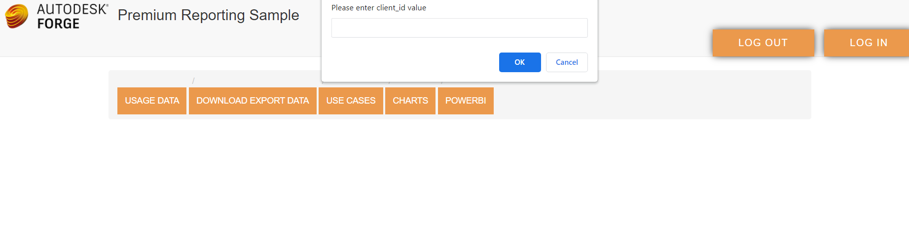
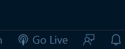

# Description

The sample helps viewing, building custom reports and exporting usage query  & export usage query API data in the form of tables, charts from Premium Reporting APIs.

Uses 3-legged oAuth2 with implicit grant to authenticate with Forge. 

### Pre-requisites

- Forge Account: Learn how to create a Forge Account, activate subscription and create an app at [this tutorial](http://learnforge.autodesk.io/#/account/)

- Visual Studio Code 

- Go Live Extension in Visual Studio Code.

- Tested to be working on: Chrome, IE Edge

- When logging into the web dashboard, you should login with the ID of an administrator with premium benefits (EBA).If you login with a user that does not have such roles, the API will return no data.

### Setup

- Create a [Forge app](https://learnforge.autodesk.io/#/account/?id=create-an-app ) with access to the Premium Reporting API.

- Take note of the Client ID which you need to enter as soon as you login.

-  Use http://localhost:5500 as redirect URL in Forge App.

- Clone or download the folder. Open the folder inside in Visual Studio Code.  

- Use http://localhost:5500 as redirect URL in the js/method.js file.

- Click Go live to run live server.

  

  

### Meta Data Mapping

- Save your metadata in the JSON format in the root folder. 
- Here is the sample of metadata.
- Make changes as per your mapping in js/jsonToTable.js file.

### Deployment

Deploy it using GitHub pages. Follow this [tutorial](https://www.youtube.com/watch?v=SKXkC4SqtRk)

Note- As soon as you deploy it the redirect URL becomes the deployment domain.

## Support

For support, please contact forge.help@autodesk.com.

## License

This sample is licensed under the terms of the [MIT License](https://tldrlegal.com/license/mit-license).
Please refer to [LICENSE](LICENSE) for more details.

## Written by

Deepali Srivastava, Forge Partner Development Group

