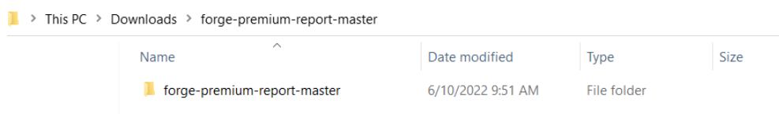

# Description

This web application helps viewing and exporting usage data  in the form of tables,charts from Premium Reporting APIs.

### Pre-requisites

- Forge Account: Learn how to create a Forge Account, activate subscription and create an app at [this tutorial](http://learnforge.autodesk.io/#/account/)

  

### Setup

- Create a Forge App with access to the Premium Reporting API 
-  Use http://localhost:5500 as redirect URL in Forge App as well as in client code.
- Clone or download the folder. Open the folder inside in Visual Studio Code.  It's recommended to install [GitHub desktop](https://desktop.github.com/). 
- For this new App, you can use http://localhost:5500 as redirect URL.
  Take note of the Client ID and Client Secret, those are your API keys that must remain hidden




- Update your client_id and client_secret in the login function of src/methods.js at line 373.


> ```javascript
>                 let clientId = "ENTER YOUR CLIENT_ID HERE" 
>                 let clientSecret="ENTER YOUR CLIENT_SECRET HERE"
>                 let scopes = "data:read+data:write+bucket:read"
>                 let redirectUri = encodeURI("http://localhost:5500")
>                 window.open(`https://developer.api.autodesk.com/authentication/v1/authorize` +
>                     `?response_type=token&client_id=${clientId}&redirect_uri=${redirectUri}&scope=${scopes}`, "_self")
>             },
> ```

- Click Go live to run live server on index.html page

- Click on Export all usage button to download xlsx file.
- Upload the file to view a tabular representation of data inside the web application.
- **Note: To view charts, you need to convert xlsx to csv https://cloudconvert.com/xlsx-to-csv and save it in the client code folder.**

